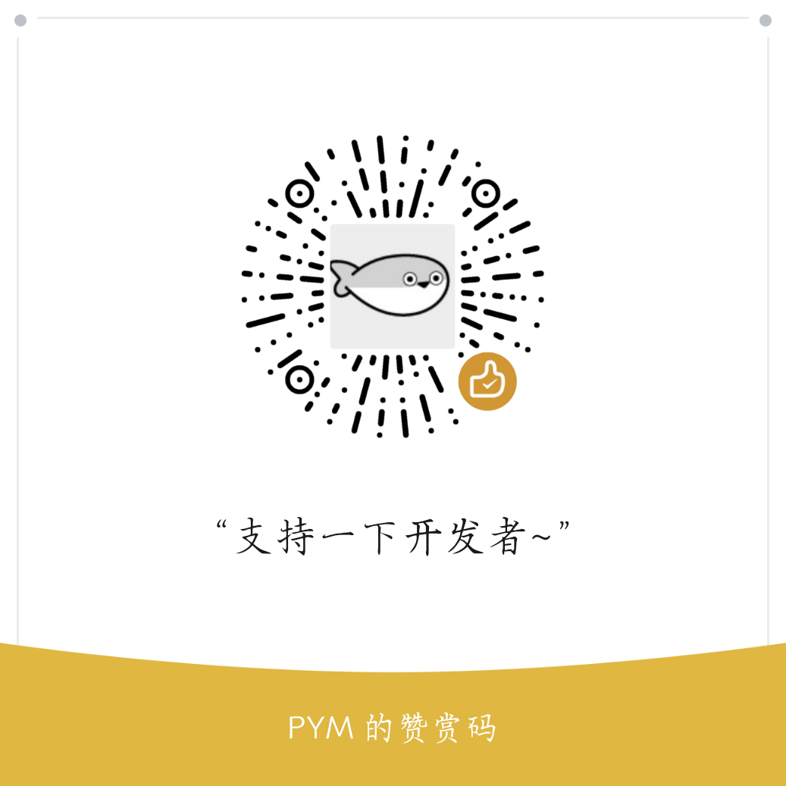

<div align="center">

# Lexfence

**基于多渠道大模型的内容安全审核系统 · 可自部署 · 开源**

[English](README.md) · **中文**

⭐ 如果这个项目对你有帮助，欢迎 **[在 GitHub 点个 Star](https://github.com/pymcn6/Lexfence-AI-Content-Moderation)** 支持一下！

**[🚀 在线体验](https://textsafe.pym.plus/demomode)** — 免注册，即点即用。

💛 **喜欢的话，[赞助本项目](sponsor.md)** — 你的支持是持续更新的动力。



</div>

---

### 功能
- **多模态审核**：文本、图片、视频三种内容一站式审核。
- **多 AI 渠道**：接入并管理 OpenAI、Claude、Gemini 及兼容服务。
- **自定义提示词与分类**：按场景定义自己的提示词模板与标签。
- **REST API**：支持同步与异步两种调用方式（异步避免长任务超时）。
- **商业化就绪**：公开落地首页、内置**定价页**（按后台配置展示每百万 Tokens 的文本/图片/视频单价，支持多货币与自定义汇率换算）、可内嵌的**充值页**（用 iframe 接入你自己的发卡网/支付页），并支持兑换码充值。
- **API 密钥管控**：每个密钥可设用量限制（每分钟/时/天/月/年最多多少 Tokens）、请求速率、有效期，并展示每个密钥的用量统计；用户级密钥配额，达上限时显示后台配置的联系方式。
- **按 Token 计费**：用量按 Token 计量，按实际消耗结算。
- **后台管理**：用户管理、配额管理、检测日志与数据看板。
- **体验模式**：在线 Demo，免部署即可试用。
- **国际化**：完整中 / 英界面。
- **部署简单**：Docker / docker-compose 一键部署。

### 快速开始（Python）
```bash
git clone https://github.com/pymcn6/Lexfence-AI-Content-Moderation.git
cd Lexfence-AI-Content-Moderation
pip install -r requirements.txt
cp .env.example .env        # 可选：修改 SECRET_KEY / DATABASE_URL
python app.py               # 开发服务器 http://127.0.0.1:5000
# 生产：gunicorn -w 4 -b 0.0.0.0:5000 --timeout 180 app:app
```
打开网站，**安装向导**会引导你选择数据库、创建管理员与站点信息；随后在「AI 渠道」中添加渠道。

### 快速开始（Docker）

**方式 A —— 一行 `docker run`（SQLite，零外部依赖）：**
```bash
docker run -d --name lexfence -p 5000:5000 \
  -e SECRET_KEY=换成你自己的长随机字符串 \
  -v lexfence_data:/app/instance \
  ghcr.io/pymcn6/lexfence-ai-content-moderation:latest
```
- `-p 5000:5000`：把容器端口映射到宿主机。
- `SECRET_KEY`：设为你自己的长随机串（留空则自动生成并持久化到 `/app/instance`）。
- `-v lexfence_data:/app/instance`：持久化 SQLite 数据库、密钥与安装锁，容器删除重建后数据不丢。

**方式 B —— Docker Compose（推荐）：**
```bash
docker compose up -d                      # 仅 app，SQLite（零依赖）
docker compose --profile mysql up -d      # app + MySQL
docker compose --profile redis up -d      # app + Redis（限流存储）
```

仓库自带的 `docker-compose.yml` 定义了三个服务（`app` 常驻；`db`、`redis` 通过 profile 按需启用）：

```yaml
services:
  app:
    # 优先使用已发布镜像（docker compose pull 即可更新）；
    # 若需本地构建，保留 build: . 并注释掉 image 那行。
    image: ${LEXFENCE_IMAGE:-ghcr.io/pymcn6/lexfence-ai-content-moderation:latest}
    build: .
    container_name: lexfence
    restart: unless-stopped
    ports:
      - "5000:5000"                        # 宿主:容器，访问 http://localhost:5000
    environment:
      # 会话密钥：留空时容器内会自动生成强随机密钥并持久化到 instance/secret_key。
      # 多副本/水平扩展部署务必显式设置同一个固定随机串（如 openssl rand -base64 48）。
      SECRET_KEY: ${SECRET_KEY:-}
      # 默认 SQLite；要用 MySQL 时取消下一行注释（或用 .env 覆盖）：
      # DATABASE_URL: mysql+pymysql://lexfence:lexfence@db:3306/lexfence?charset=utf8mb4
      DEFAULT_LOCALE: ${DEFAULT_LOCALE:-en}  # 默认界面语言：en / zh
      # RATELIMIT_STORAGE_URI: redis://redis:6379/0   # 启用 redis profile 时打开
    volumes:
      - ./instance:/app/instance           # 持久化 SQLite 数据库、密钥、安装锁

  db:                                       # MySQL —— 仅 `--profile mysql` 时启动
    image: mysql:8.4
    container_name: lexfence-mysql
    profiles: ["mysql"]
    restart: unless-stopped
    environment:
      MYSQL_DATABASE: lexfence
      MYSQL_USER: lexfence
      MYSQL_PASSWORD: lexfence              # 生产环境请修改
      MYSQL_ROOT_PASSWORD: ${MYSQL_ROOT_PASSWORD:-rootpass}
    command: --character-set-server=utf8mb4 --collation-server=utf8mb4_unicode_ci
    volumes:
      - mysql_data:/var/lib/mysql           # 持久化 MySQL 数据
    ports:
      - "3306:3306"                         # 生产环境建议去掉此映射（仅容器内访问）

  redis:                                    # Redis 限流存储 —— 仅 `--profile redis` 时启动
    image: redis:7-alpine
    container_name: lexfence-redis
    profiles: ["redis"]
    restart: unless-stopped
    ports:
      - "6379:6379"

volumes:
  mysql_data:
```

提示：在 `docker-compose.yml` 同目录放一个 `.env` 文件，写上 `SECRET_KEY=...`（用 MySQL 再加 `MYSQL_ROOT_PASSWORD=...`），Compose 会自动加载。启动后打开 **http://localhost:5000** 进入安装向导。

### 发布版本（网页端，v2.4.0）
1. 本地提交改动并推送分支。
2. 打 tag 并推送：`git tag v2.4.0 && git push origin v2.4.0`。
3. 在 GitHub 打开 **Releases → Draft a new release**，选择 tag `v2.4.0`，填写说明后 **Publish**。仓库内置的 GitHub Actions 工作流会自动构建并推送 Docker 镜像到 GHCR。

**切勿上传以下文件**（`.gitignore` 已默认忽略）：`.env`、整个 `instance/` 目录（SQLite 数据库、`secret_key`、安装锁）、任何 `*.db` / `*.sqlite3` 文件，以及 `__pycache__/`。只提交 `.env.example`（仅占位符）。

### 赞助
喜欢这个项目？看看[赞助页](sponsor.md) —— 感谢支持！

### 许可证
MIT © pymcn

---

<div align="center">

⭐ **[在 GitHub 点个 Star](https://github.com/pymcn6/Lexfence-AI-Content-Moderation)** ⭐

</div>
